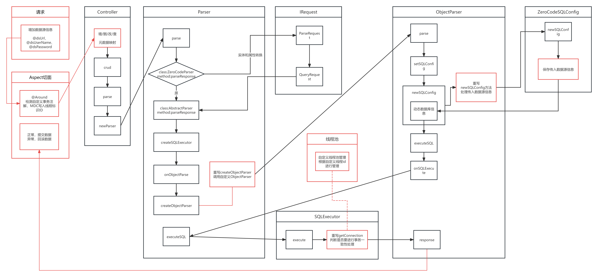

# apijson-dynamic-datasource  

项目中简单的实现了如下特性：
1. 使用APIJSON如何在
2. 在进行跨表批量增删改时如何保持事务一致性

[APIJSON更多信息请查看](http://apijson.cn/)

## 原理简述

在APIJSON的基础上，增加`@ADDTransactional`注解与AOP切面方法结合，找到跨表的批量操作并传递信号量，  
根据信号量判断是否走源生commit事件，还是在AOP切面方法执行后统一commit  
并增加对传入数据源信息参数的读取和使用  
增加一个简单的连接池优化对数据库资源的使用



- **黑色**：原APIJSON代码
- **红色**：增加的代码

## 示例使用

在[DemoController.java](src%2Fmain%2Fjava%2Fcn%2Fwubo%2Fapijson%2Fdynamic%2Fdatasource%2Fcontroller%2FDemoController.java)中增加saveBatch方法批量处理增删改查操作，  

请求url:  
http://localhost:8080/saveBatch

请求示例:
```json
[
  {
    "method": "post",
    "data": {
      "CZKTEST40": {
        "business_code": "f15afbd7-5f82-413d-85a6-d2054d60061a",
        "item_code": 1,
        "id": "010",
        "@dsUrl": "jdbc:mysql://10.133.92.80:3306/erp_dev_demo?serverTimezone=GMT%2B8&useUnicode=true&characterEncoding=UTF-8&allowMultiQueries=true",
        "@dsUserName": "root",
        "@dsPassword": "Mysql@2020"
      }
    }
  },
  {
    "method": "post",
    "data": {
      "CZKTEST40": {
        "business_code": "f15afbd7-5f82-413d-85a6-d2054d60061a",
        "item_code": 1,
        "id": "020",
        "@dsUrl": "jdbc:mysql://10.133.92.80:3306/erp_dev_demo?serverTimezone=GMT%2B8&useUnicode=true&characterEncoding=UTF-8&allowMultiQueries=true",
        "@dsUserName": "root",
        "@dsPassword": "Mysql@2020"
      }
    }
  }
]
```

响应示例
```json
[
  {
    "msg": "success",
    "CZKTEST40": {
      "msg": "success",
      "code": 200,
      "@dsPassword": "Mysql@2020",
      "@dsUserName": "root",
      "count": 1,
      "id": "010",
      "ok": true,
      "@dsUrl": "jdbc:mysql://10.133.92.80:3306/erp_dev_demo?serverTimezone=GMT%2B8&useUnicode=true&characterEncoding=UTF-8&allowMultiQueries=true"
    },
    "code": 200,
    "ok": true
  },
  {
    "msg": "success",
    "CZKTEST40": {
      "msg": "success",
      "code": 200,
      "@dsPassword": "Mysql@2020",
      "@dsUserName": "root",
      "count": 1,
      "id": "020",
      "ok": true,
      "@dsUrl": "jdbc:mysql://10.133.92.80:3306/erp_dev_demo?serverTimezone=GMT%2B8&useUnicode=true&characterEncoding=UTF-8&allowMultiQueries=true"
    },
    "code": 200,
    "ok": true
  }
]
```